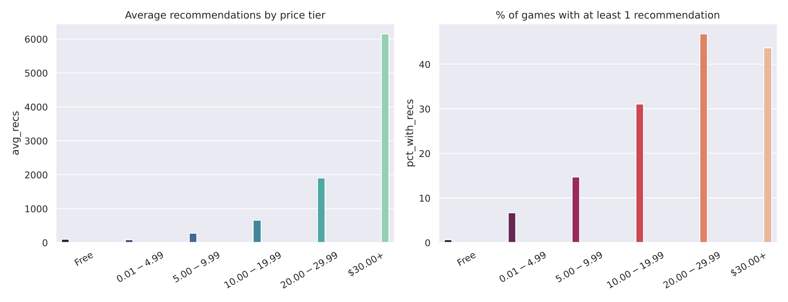

# Steam Market Intelligence Platform

A website that analyses **65,000+ Steam games** (released 2021–2025) and helps indie developers pick a price, a genre and understand their competition. Written in Python; the site is served by a small Python web server and the dashboard is drawn in the browser with Plotly.

## Features
- **Market overview** – filter by price tier / minimum recommendations; metrics and 4 interactive charts.
- **Competitor benchmark** – search any game, see where it sits in its genre (percentile radar) and its closest price competitors.
- **Ask the Data** – type plain English such as *"Top 5 RPGs under $20"* or *"Free action games released in 2024"*. A parser turns it into safe SQL.
- **Raw data** – browse the top rows and download the filtered CSV.

## Key findings (from `python analysis.py`)
1. **Higher price tiers get more recommendations.** Average recommendations: Free ≈ 96, $0.01–$4.99 ≈ 82, $10–$19.99 ≈ 661, $20–$29.99 ≈ 1,907, $30+ ≈ 6,148. (Correlation, not proof: bigger studios with bigger budgets also charge more.)
2. **Most games are never recommended.** Only 12% of all games have at least one recommendation, and the median is 0. Just 0.7% of free games and 6.7% of $0.01–$4.99 games get any, versus about 31% at $10–$19.99 and 44–47% at $20+.
3. **The store is getting crowded.** Releases grew from about 8,400 in 2021 to about 20,100 in 2025.
4. **Genres:** Massively Multiplayer, RPG and Action have the highest average recommendations; Indie and Strategy the lowest of the top ten. Genres are counted one by one (a game with `Action;RPG` counts for both).



## Project files
| File | Purpose |
|------|---------|
| `db_pipeline.py` | `SteamPipeline` class: CSV → clean → SQLite (`fact_steam_games`, `dim_genres`, view, indexes) |
| `server.py` | The website's backend: `QueryParser`, `SteamDatabase` and `SteamHandler` classes |
| `static/` | Front end: `index.html`, `style.css`, `app.js`, `plotly.min.js` |
| `analysis.py` | Static analysis + saved chart |
| `data/` | `steam_games.csv` and the generated `steam_warehouse.db` |

## Programming concepts used
- **Classes and objects:** `SteamPipeline`, `QueryParser`, `SteamDatabase`, `SteamHandler`.
- **Exception handling:** missing CSV (`FileNotFoundError`), database errors (`sqlite3.Error`), bad user input (`ValueError`), and a catch-all so the server never crashes; the browser shows a friendly message.
- **`break`:** `QueryParser.parse` stops at the first genre it finds in the question.
- Also: list comprehensions, f-strings, parameterised SQL (no SQL injection), dictionaries, regular expressions.

## Run it on your computer
```bash
pip install -r requirements.txt
python db_pipeline.py      # builds data/steam_warehouse.db (the server also does this automatically)
python server.py           # open http://localhost:8000
python analysis.py         # optional: prints tables and saves the chart
```

## Deploy it as a real website (Render – free tier)
1. Put this folder in a GitHub repository (keep `data/steam_games.csv`).
2. On [render.com](https://render.com) choose **New → Web Service** and connect the repository.
3. Settings: **Build command** `pip install -r requirements.txt` · **Start command** `python server.py`.
4. Click **Deploy**. Render supplies the `PORT` variable, which `server.py` reads automatically, and you get a public `https://…onrender.com` link.

Any host that runs Python (Railway, Fly.io, a VPS, …) works the same way: install the requirements and run `python server.py`.
